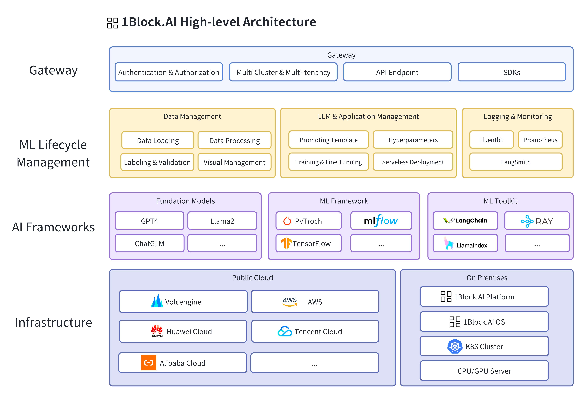

# 1Block.AI [WIP]
[](https://github.com/oneblock-ai/oneblock/actions/workflows/main-release.yaml)
[](https://goreportcard.com/report/github.com/oneblock-ai/oneblock)
[](https://github.com/oneblock-ai/oneblock/releases)
[](https://discord.gg/wUekphG8)

| 🚧 WARNING | 1Block.AI is a work in progress. Features will evolve over time and there may be breaking changes between releases. Please refrain from using it for any production purposes for now! |
|------------|:--|

An open-source, cloud-native LLMOps platform for LLMs and generative AI applications management.

## Description
1Block.AI is an open-source, cloud-native LLMOps platform that aims to empower your innovation in LLMs and generative AI applications. It is built on top of cutting-edge technologies such as Kubernetes, Ray.io, LangChain, etc., and designed to be cloud-agnostic and ML framework agnostic.

Below are the key features of the 1Block.AI:

1. [x] **Easy Installation:** [1Block.AI](http://1block.ai) can be directly installed on any Kubernetes cluster, offering an out-of-the-box user experience.
1. [ ] **Complete LLM Lifecycle Management:** Provides a unified interface for both developers and non-developers to manage the entire life cycle of Large Language Models (LLMs) and generative AI applications.
1. [ ] **Multi-model Support:** Integrates seamlessly with popular LLM models (e.g., GPT-3.5, GPT-4, Llama-2, ChatGLM, etc.). Allows iterative upload, tracking, and management of custom model versions, associating them with specific datasets and hyperparameters.
1. [ ] **Multi-cloud Compatibility:** Supports deploying your LLM and AI applications to various clouds, including AWS, GCP, Aliyun, Azure, etc., as well as on-premise environments.
1. [ ] **Built-in Multi-tenant & Multi-cluster Support:** Utilizes RBAC policies for built-in multi-tenant support, enabling users to manage resources across multiple clusters.
1. [ ] **Effortless Deployment & Monitoring:** One-click deployment of AI applications to different clouds with auto-scaling capabilities (serverless). Ensures easy monitoring of your applications by tracking traffic, inference, and resource usage.

The following diagram outlines a high-level architecture of the 1Block.AI



## Getting Started

### Prerequisites
- Helm v3.0.0+
- Access to a Kubernetes v1.23+ cluster.

### Installation
To deploy the 1Block.AI on your k8s cluster, you can use the following commands:

**Install the CRDs into the cluster:**

```sh
$ make install
```
or
```sh
$ helm upgrade --install --create-namepsace -n oneblock-system oneblock-crd ./deploy/charts/oneblock-crd
```

**Deploy the api-server to the cluster:**

```sh
$ make deploy
```
or
```sh
$ helm upgrade --install --create-namespace -n oneblock-system oneblock ./deploy/charts/oneblock
```

### Uninstall
**Delete the CRDs and api-server from the cluster:**

```sh
$ helm uninstall -n oneblock-system oneblock-crd
$ helm uninstall -n oneblock-system oneblock
```
or
```sh
$ make uninstall && make undeploy
```

## Contributing
For the basics on how to contribute to 1Block.AI, checkout [CONTRIBUTING.md](./CONTRIBUTING.md).


## Community
If you're interested, please join us on [Discord](https://discord.gg/wUekphG8) or participate in [GitHub Discussions](https://github.com/oneblock-ai/oneblock/discussions) to discuss or contribute the project. We look forward to collaborating with you!

If you have any feedback or issues, feel free to file a GitHub [issue](https://github.com/oneblock-ai/oneblock/issues).

## License

Copyright (c) 2023 [1Block.AI.](https://1block.ai/)

Licensed under the Apache License, Version 2.0 (the "License");
you may not use this file except in compliance with the License.
You may obtain a copy of the License at

    http://www.apache.org/licenses/LICENSE-2.0

Unless required by applicable law or agreed to in writing, software
distributed under the License is distributed on an "AS IS" BASIS,
WITHOUT WARRANTIES OR CONDITIONS OF ANY KIND, either express or implied.
See the License for the specific language governing permissions and
limitations under the License.

