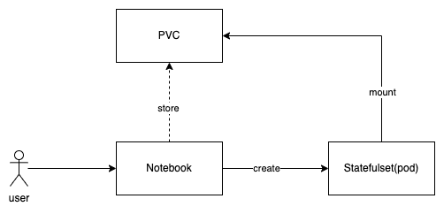

# Notebooks

## Summary

A notebook is a web-based, interactive computational environment designed for creating projects that seamlessly integrate live code, equations, narrative text, visualizations, interactive dashboards, and other media. It serves as a powerful tool for data scientists, offering them a unified platform for prototyping and sharing their work.

> Note: We will be referring the design from [Kubeflow Notebook](https://www.kubeflow.org/docs/components/notebooks/).

### Related Issues

- https://github.com/oneblock-ai/oneblock/issues/17

## Motivation

### Goals
- Web-Based Native Notebook Support: Offer native support for Jupyter, Visual Studio Code, and RStudio within the web-based environment.
- Cluster-Based Notebooks: Enable users to create notebooks directly within the cluster, eliminating the need to work locally on their workstations.
- Streamlined Notebook Sharing: Facilitate easier notebook sharing across the organization by leveraging k8s namespace and RBAC.
- Admin Configuration: Empower administrators to provide standardized notebook images for their organization, ensuring the inclusion of required pre-installed packages.

### Non-goals [optional]
- N/A

## Proposal

### User Stories

#### Story 1

As a normal user, I should be able to create and access a notebook server with a single click. The notebook data should be persistent in the cluster. Users within the same namespace should be able to access the notebook directly.

1. User should be able to create a notebook server with a single click.
2. User should be able to access the notebook server from the browser.
3. Notebook data stored is stored in the cluster using the PVC mechanism.
4. Users within the same namespace should be able to access the notebook server.

#### Story 2

As an admin user, I should be able to customize the notebook images for the organization.
1. System should provide a list of built-in notebook images.
2. Admin user should be able to configure the default notebook image for the organization.

### Implementation Details

#### API changes

We will introduce a new CRD named `Notebook` to create and manage the notebook server.

```YAML
apiVersion: ml.oneblock.ai/v1
kind: Notebook
metadata:
  name: nb-jupyter
  namespace: default
  labels:
    ml.oneblock.ai/notebook-type: juptyer
spec:
  serviceType: NodePort
  template:
    spec:
#      runtimeClassName: nvidia # enable when GPU is required
      containers:
      - image: kubeflownotebookswg/jupyter-scipy:v1.8.0
        name: nb-jupyter
        resources:
          requests:
            cpu: 200m
            memory: 500Mi
          limits:
            cpu: 500m
            memory: 1Gi
#           nvidia.com/gpu: 1 # optional, requesting 1 GPU
        volumeMounts:
        - mountPath: /home/jovyan
          name: test-vol
        - mountPath: /dev/shm
          name: dshm
      volumes:
      - name: test-vol
        persistentVolumeClaim:
          claimName: nb-jupyter
      - emptyDir:
          medium: Memory
        name: dshm
```

We will also add a new setting `notebook-default-images` to allow admin to configure the standardized notebook images.

```YAML
apiVersion: management.oneblock.ai/v1
kind: Setting
metadata:
  name: notebook-default-images
default: '{"code-server":[{"containerImage":"kubeflownotebookswg/codeserver-python:v1.8.0","description":"Visual Studio Code + Conda Python","default":true}],"jupyter":[{"containerImage":"kubeflownotebookswg/jupyter-scipy:v1.8.0","description":"JupyterLab + PyTorch","default":true},{"containerImage":"kubeflownotebookswg/jupyter-pytorch:v1.8.0","description":"JupyterLab + PyTorch"},{"containerImage":"kubeflownotebookswg/jupyter-pytorch-full:v1.8.0","description":"JupyterLab + PyTorch + Common Packages"},{"containerImage":"kubeflownotebookswg/jupyter-pytorch-cuda:v1.8.0","description":"JupyterLab + PyTorch + CUDA"},{"containerImage":"kubeflownotebookswg/jupyter-pytorch-cuda-full:v1.8.0","description":"JupyterLab + PyTorch + CUDA + Common Packages"},{"containerImage":"kubeflownotebookswg/jupyter-tensorflow:v1.8.0","description":"JupyterLab + PyTorch"},{"containerImage":"kubeflownotebookswg/jupyter-tensorflow-full:v1.8.0","description":"JupyterLab + PyTorch + Common Packages"},{"containerImage":"kubeflownotebookswg/jupyter-tensorflow-cuda:v1.8.0","description":"JupyterLab + PyTorch + CUDA"},{"containerImage":"kubeflownotebookswg/jupyter-tensorflow-cuda-full:v1.8.0","description":"JupyterLab + PyTorch + CUDA + Common Packages"}],"rstudio":[{"containerImage":"kubeflownotebookswg/rstudio-tidyverse:v1.8.0","description":"RStudio + Tidyverse","default":true}]}'
```

## Design

Below is the high-level design diagram of the notebook server.



### Implementation Overview

- Notebook setting:
    - Store the default notebook images to the `default-notebook-images` `Setting` CR, it is categorized into the following three types:
      - `code-server`: Visual Studio Code
      - `jupyter`: JupyterLab
      - `rstudio`: RStudio
  > Note: We will be using the [container images](https://www.kubeflow.org/docs/components/notebooks/container-images/) provided by kubeflow for the notebook server. 

- Notebook parameters:
  - Notebook is a namespaced resource, it is created under the namespace where the user is currently in.
  - Notebook CR is created by the user, it contains the following information:
    - Name: Name of the notebook server, required
    - Namespace: Namespace where the notebook server is created, required
    - ServiceType: Service type of the notebook server, optional, default to `ClusterIP`
    - Spec.Template.Spec: Template spec of the notebook server, required and identical to the `Pod` spec.
      - `Container[0].Name`: should be identical to the notebook name.
      - `Container[0].Resources`: both `requests` and `limits` are required, limits will be set same to `requests` if not provided.
      - GPU support: add `nvidia.com/gpu` to the `limits` and `spec.runtimeClassName: nvidia` to the notebook `template.spec` if GPU is required.
    - Labels: add `ml.oneblock.ai/notebook-type: jupyter/code-server/rstudio` when creating a new notebook CR
    - Volumes: add `volumeMounts` and `volumes` to the notebook `template.spec`, both `/home/jovayan` and `/dev/shm` are required.

- PersistentVolumeClaim: PVC is required to provide persistent storage for the notebook server, it is created manually first by the user before the notebook CR is created.
    - Name: Name of the PVC, it is usually identical to the notebook name.
    - Namespace: Namespace where the notebook server is created, it is identical to the notebook namespace.
    - AccessModes: access mode is required.
    - StorageClassName: storage class name is required, use empty string `""` if default storage class is used.
    - Capacity: capacity is required, e.g., 1Gi.

### Test plan

- Add unit test plan.
- Add integration test plan.
- Add e2e test plan.
  - Create a notebook server with the default image.
  - Create a notebook server with a custom image.
  - Create a notebook server with GPU support.
  - Create a notebook server with a custom PVC.
  - UI: UI should render the default notebook images correctly if the `notebook-default-images` setting is changed.

### Upgrade strategy

N/A

## Note

N/A
